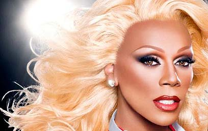

# “I’m Juicy, Not a Bitch”  

### Interview with RuPaul

## After reality shows about music, design, and modeling comes a program that will crown America’s next drag queen.  
**Nimrod Dvir**  
Published: 03.07.09, 11:16 ([ynet.co.il](https://www.ynet.co.il/articles/0,7340,L-3737578,00.html))  

---

When I reached RuPaul’s office in New York to interview him for the Israeli version of *Viva La Diva* (Yes Stars Real), the call was met with howls and hysterical laughter — as if I had crashed a wild drag party.

**– What are you doing there?**  
“Nothing, we just relax, rest, and look f-a-b-u-l-o-u-s,” he says in a pampered tone. “Honestly, we were laughing at the journalist who just interviewed me. I’ve been doing interviews for three centuries, and I can tell you: there are journalists who shouldn’t even be there.”

He was asked if he identified with the goals of one gay-pride charity he was performing for next week. “Hell, what should I say to that? That I have no clue what the organization does? They hire me, I perform, I leave. Period.”

Once among the most polished drag icons in the U.S. for over 25 years, RuPaul now bristles at the idea of fakery. “Years ago I’d fake it — and spin some narrative about the importance of gays helping gays. But now I simply say ‘fuck that’. I prefer being real.”

---

### 🎤 On the Show *Viva La Diva*  

  

RuPaul describes his legacy: mass performances, hosting shows and specials, cameo appearances, albums (including “Supermodel”), and a bestselling autobiography. He is now launching *Viva La Diva* in Israel, where drag queens compete for the crown.

**– Sometimes the contestants seem ridiculous, screaming that their makeup is ruined.**  
“There’s a fine line between laughing at someone and laughing with someone. Not long ago I worked with writers I didn’t know. They tried writing jokes — but I told them, ‘Sweethearts, I’m juicy, but I’m not a bitch.’ People don’t understand the difference.”

**– Why do you use feminine pronouns for the contestants?**  
“We’re in the 21st century. It’s totally meaningless not to. I call the contestants ‘girls’ because I respect them — and life needs humor.”

**– How do you compare this to Tyra Banks’s “Next Top Model”?**  
“You can compare if you want. It’s a reality show with girls competing to stay or go. But that’s it. The only similarities are humor and synthetic wigs.”

**– And nails?**  
  

“We had small feuds, but not insane ‘Bitch Fights’. Watching someone create from nothing — that’s drama. The real challenge is seeing creative performers making something together. In that sense, we’re more like *Project Runway*: drama in creation, not fighting over who stole whose mascara.”

**– You appear sometimes as a man in episodes. Why?**  
“I have to, otherwise it undermines my authority as an expert. People need to see from what point I begin and where I can take it. I want the winner to be like me: doing music, TV, film, books — the next super-star of drag, speaking for those who think differently.”

---

### 💄 Rays, Tips & Identity  

  

The show airs on Logo (a queer network in the U.S.) and has been renewed for a second season. Now in casting mode, RuPaul asks potential contenders: “Do you have lipstick?”

He is busy touring, promoting his latest album *Champions* (inspired by the show), and writing a book of drag secrets for women.

**– Give them a tip.**  
“Here’s one on the house. There’s a drag queen technique for applying false eyelashes. It’s hard to apply them in one piece. Many women skip them. What works is: cut lashes into four pieces, apply glue to each, then use tweezers to attach them to real lashes. You get lashes that look natural.”

**– So… are you single?**  
“You suggesting something? I believe strongly in love. Anyone I’ve had a relationship with — I’m still in a relationship with them. But no, right now I have no one. Everyone’s in a relationship with me,” he jokes.

He once visited Israel in 2003.

**– Do you think an Israeli drag queen could win your show?**  

  

“Absolutely. Funny story: I came to Tel Aviv for Pride events. I was only supposed to stay a weekend, but the airline lost my luggage. It worked out — I ended up staying ten days. I toured Jerusalem, the Dead Sea. I wasn’t prepared for how spiritual it would feel.

The funniest moment was when a woman recognized me on the street, invited me into her apartment — and I went. There were people smoking weed. It was a wild night. I didn’t meet many queens there; I met *Dana International*, but she’s not a queen — she’s transgender.

I’m sure there are worthy candidates in Israel. All you need to be a queen is imagination, love of beauty, and pop culture knowledge. I believe Israeli kids can do that.”

---

### 📌 Notable Citations

> “Nothing, we just relax, rest, and look f-a-b-u-l-o-u-s.”  

> “Three centuries of interviews…”  

> “Sweethearts, I’m juicy, but I’m not a bitch.”  
> “The real challenge is seeing creative performers making something together.”  
> “Cut lashes into four pieces… then use tweezers…”  
> “Everyone’s in a relationship with me.”  
> “All you need to be a queen is imagination, love of beauty, and pop culture knowledge.”  
