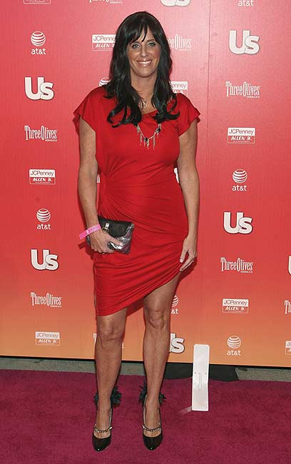

# Money Can Buy Love

**Patti Stanger hit upon a brilliant startup when she opened an agency specializing in matchmaking for millionaires and took over the most profitable dating market in the United States. In addition, she became a huge star with her show "Who Wants to Marry a Millionaire."**

**Nimrod Dvir**

One of the things I appreciate most in the world is people who can take something completely trivial and turn it into an empire. One of those people is Patti Stanger, who built a multi-million dollar career from an idea so idiotic it’s genius: she's a matchmaker for millionaires. Stanger spends her days mingling with the top one percent in Los Angeles, finding attractive women or handsome men for the millionaires and millionairesses who hire her services.

**Stanger. Dates worth millions (Photo: Public Relations)**

Besides her successful agency, Millionaires Club, Stanger is also about to launch a website in collaboration with Jdate, is working on books, and stars in her own reality show, "Who Wants to Marry a Millionaire" (broadcasted here on yes). A quick phone call with Stanger clarifies that behind the luxurious facade lies a businesswoman from New Jersey. She speaks with a heavy Jersey accent, pushes her business in every other sentence, and even tries to make deals between questions (like offering me free membership if I bring her Jewish millionaires). No doubt, a girl after my own heart.

## How did you get into matchmaking for millionaires?

"I worked for many years in 'regular' matchmaking. I got it from home - both my mom and my grandma were matchmakers. But they did it voluntarily, in their local synagogue in New Jersey. I took it in a professional direction, and for many years worked at 'Great Expectations', a large matchmaking company in the United States. I matched 'regular' people, but over time I realized that millionaires were my specialty, and I opened my own agency that deals only with them."

## Charging Women More

The business paid off: Patti's agency, "Millionaires Club," located in Los Angeles, California, charges $25,000 for a man and $50,000 for a woman. Why? Because men are a rarer and more sought-after commodity in the brutal dating market. Stanger won't disclose numbers, but it's a very profitable business. She became so famous in America that last year she was approached by the American network Bravo and offered her own reality show, in which she matches in prime time. She said yes, and the rest is history.

## What exactly do you do?

"It's an endless job, as seen on the show. I meet with potential millionaires, meet with people who want to match with millionaires, think about who fits whom. I teach the people who come to me how to behave, what to say, and what to do on dates. I give my clients what they want. It's a tough business because there's no one-size-fits-all. All my clients are different, and I have to adapt myself."

**The Dating Market in Her Hands**

"In general, in the first stage, I meet with the millionaire or millionairess, get to know them and what they are looking for. This is the stage of matching reality - they usually want a fantasy and my job is to bring them down to earth and explain that they need to be realistic."

"Then I meet with potential matches, interview them to see if they fit, and then accompany the dating stage, from choosing the meeting place to preparing for it in terms of clothing and manners, tips, etc. Then I follow up to see how it went. I accompany the process throughout, backed by a professional team of psychologists, stylists, and interior designers. It's not an easy job at all."

## Why is your connection with millionaires so good? Did you come from a rich family?

"Not at all, from a very normal family. I just know how to behave with them. I understand that they are people with very high expectations who want a fantasy. I also know how to tell them the truth to their faces, without being embarrassed. They like that."

## Knows How to Handle It

Indeed, watching the show shows that Patti, with all her (obvious) fondness for people with money, also knows how to handle it when necessary. More than once she screams at a client to stop being a chauvinist pig and look for women over 23, or at a woman that it's time to give up the pool boy and go for a guy with a little more depth.

"I'm not afraid to say what I think," she says. "It's my job to bring them back to reality. I think it's one of the most important elements in matchmaking: your expectations need to be based and fit reality. If you sit around all day waiting for an unattainable ideal, most likely you'll stay alone. I force people to take inventory, understand what's achievable and what's not, and be happy with what they have."

## Where does your confidence come from? I'm a devoted viewer, and I've never seen you lose your cool.

"Look, I'm 47, I've done a few rounds around the block. I've learned things and I apply them. I know there are viewers who say I'm vulgar or too confident, and they are welcome to change the channel. I've made peace with myself and what I do many years ago."

## You can read the full interview with Stanger in the latest issue of Pnai Plus

### Tags:
[Nimrod Dvir](http://www.ynet.co.il/tags/%D7%A0%D7%9E%D7%A8%D7%95%D7%93_%D7%93%D7%91%D7%99%D7%A8) | [Love](http://www.ynet.co.il/tags/%D7%90%D7%94%D7%91%D7%94) | [Money](http://www.ynet.co.il/tags/%D7%9B%D7%A1%D7%A3)

[Back](JavaScript: history.go(-1))
